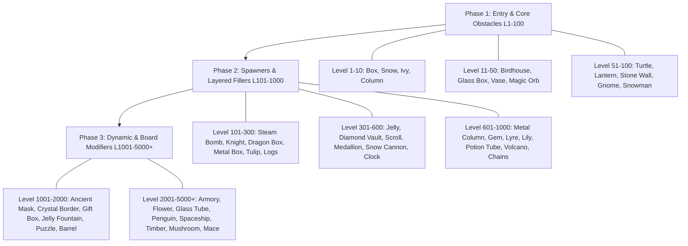

# Royal Kingdom Style Level Feature & Step-by-Step Development Plan
> **Document Status**: Complete Spec & Architecture Plan  
> **Target Project**: `RoyalPuzzle` (Godot 4 Engine Match-3 Core)  
> **Reference Benchmark**: Royal Kingdom vs. Royal Match Gimmick Evolution & Level Unlock Progression

---

## 1. 개요 및 핵심 개발 철학 (Overview & Core Philosophy)

로열 킹덤(Royal Kingdom)은 로열 매치(Royal Match)의 성공적인 매치3 매커니즘을 기반으로 하되, **레벨별 요소(Gimmick/Obstacle)의 언락 순서와 난이도 템포(Pacing)를 파격적으로 재배치**한 게임 디자인을 보여줍니다.

### 핵심 차이점 및 인사이트:
1. **빠른 기믹 도입 템포 (Aggressive Early Unlock)**:
   - 로열 매치에서는 레벨 81(꿀), 141(아이스 바), 551(흙), 1501(젤리 메이커), 3201(자석) 등에 등장하는 고급 기믹들이 로열 킹덤에서는 레벨 7(담쟁이덩굴), 11(기둥), 71(돌담), 161(드래곤 상자), 451(메달리온)로 **초중반(Level 1~500)에 대거 전진 배치**되었습니다.
2. **다양한 상호작용 형태 및 비대칭 설계 (Complex Layer & Dynamic Movement)**:
   - 동일한 컨셉의 요소라도 로열 킹덤은 레이어(층수)를 늘리거나(예: 무기고 10층 vs 오리 사격 5층), 보드 위에서 움직이게 만들고(드래곤 둥지 3단계 2층 이동), 보드 확장/해제 조건을 다변화(젤리 분수 vs 젤리 폭탄)하여 플레이어에게 더욱 다이내믹한 전략성을 제공합니다.
3. **단계별 레벨 개발계획 수립의 목적**:
   - `RoyalPuzzle` 프로젝트에서 로열 킹덤 체계에 맞춘 **50여 종 이상의 기믹 클래스 체계 및 레벨별 데이터 템플릿**을 수립하고, 이를 단계별(Sprint)로 개발 및 검증하는 가이드라인을 제공합니다.

---

### 1.5 Funconomy 심층 분석 기반 게임 디자인 3대 핵심 기둥 (Funconomy Insights)

[Funconomy의 Royal Kingdom 디자인 해체 분석](https://www.funconomy.com/post/unpacking-royal-kingdom-s-design)에 따른 핵심 기획 지침:

1. **플로우 상태 퍼즐 디자인 (Flow-State Puzzle Design)**:
   - 불필요한 기능(Feature Creep)을 배제하고, 손맛 높은 연쇄 폭발(Cascade)과 정교한 무브 제한(Move Limit)으로 플레이어를 몰입 상태로 유도합니다.
2. **목표 메타게임 루프 (Meta-Game & Objective Loop)**:
   - 각 레벨은 단순 점수 달성이 아닌 **특정 장애물 제거 및 수집(예: 상자 10개, 새 5마리)**을 명확한 승리 조건(Target Objectives)으로 부여합니다.
   - 클리어 시 획득한 보상(별/골드)으로 영지를 복원하는 직관적인 루프를 형성합니다.
3. **무마찰 페이싱 및 레벨 밸런싱 (No-Friction Pacing & Economy)**:
   - 무브 수 감소와 장애물 배치 밀도를 정밀하게 조절하여, 과도한 실패 스트레스 없이 성취감을 극대화합니다.


---

## 2. 로열 킹덤 vs 로열 매치 요소 상세 비교 분석 매트릭스

| 로열 킹덤 요소 | RK 등장 레벨 | 로열 매치 대치 요소 | RM 등장 레벨 | 기믹 분류 및 특성 | 핵심 차이점 및 메커니즘 분석 |
| :--- | :--- | :--- | :--- | :--- | :--- |
| **상자 (Box)** | 1레벨 | 상자 (Box) | 1레벨 | 기본 파괴형 (1-3층) | 매치 또는 폭발 파구 가능 (동일) |
| **눈 (Snow)** | 4레벨 | 잔디 (Grass) | 4레벨 | 필드 레이어형 | 타일 하단 레이어, 매치 시 제거 (동일) |
| **담쟁이덩굴 (Ivy)** | 7레벨 | 꿀 (Honey) | 81레벨 | 확산형 (Spreader) | 매치 안 할 시 주변 타일로 번짐. RK에서 대폭 일찍 등장 |
| **기둥 (Column)** | 11레벨 | 아이스 바 (Ice Bar) | 141레벨 | 고정 장애물 | 특수 폭발로만 파괴 가능한 세로/가로 기둥 장애물 |
| **올빼미 새집 (Birdhouse)**| 16레벨 | 우편함 (Mailbox) | 21레벨 | 수집물 스포너 | 옆에서 매치 시 새/우편물 발사 |
| **잔 박스 (Glass Box)** | 21레벨 | 찬장 (Cupboard) | 11레벨 | 내부 수집형 | 외곽 상자 파괴 후 내부 잔 수집 |
| **꽃병 (Vase)** | 31레벨 | 달걀 (Egg) | 31레벨 | 카운트다운형 | 단계별 파괴 요소 |
| **마법 구슬 (Magic Orb)** | 41레벨 | 물약 병 (Potion Bottle) | 41레벨 | 선반/다중 수집 | RK는 선반에 **커튼 구조 추가**로 시각적/기믹 레이어 차이 |
| **거북이 (Turtle)** | 51레벨 | 새 (Bird) | 101레벨 | 이동/자유 타일 | 매치 시 보드 밖으로 날아감 |
| **등불 (Lantern)** | 61레벨 | 꽃병 (Vase) | 51레벨 | 다단계 파괴형 | 주변 매치로 불 끄기/켜기 |
| **돌담 (Stone Wall)** | 71레벨 | 흙 (Dirt) | 551레벨 | 필드 블록형 | RK에서 엄청나게 일찍 등장하여 초반 난이도 변주 |
| **노움 (Gnome)** | 81레벨 | 도자기 돼지 저금통 | 161레벨 | 블록 발굴형 | 장애물 제거 후 아래 은닉 노움/돼지 수집 |
| **눈사람 (Snowman)** | 91레벨 | 덤불 (Bush) | 71레벨 | 2단계 파괴형 | 주변 매치로 형태 변경 후 제거 |
| **증기 폭탄 (Steam Bomb)**| 101레벨 | 다이너마이트 상자 | 351레벨 | 카운터 턴 폭탄 | 지정 턴 내 파괴하지 않으면 장애물 방출 |
| **기사 (Knight)** | 121레벨 | 금고 (Safe) | 91레벨 | 내구도 높은 블록 | multi-hit 파괴형 |
| **과녁 (Target)** | 141레벨 | 찻잔 선반 | 401레벨 | 조준/사격 수집형 | 특수 조합/매치로 과녁 명중 수집 |
| **드래곤 상자 (Dragon Box)**| 161레벨 | 젤리 메이커 | 1501레벨 | 둥지 스포너 | RK: 3단계가 **2층 구조 및 이동**, RM: 1층 고정 |
| **금속 상자 (Metal Box)**| 181레벨 | 올빼미 조각상/돌 | 61/301레벨 | 특수 아이템 전용 파괴 | 특수 블록 폭발로만 피해 받음 |
| **꽃병/튤립 (Tulip)** | 201레벨 | 마법 모자 | 231레벨 | 색상 맞춤 수집 | 특정 색상 매치 연동 |
| **통나무/말 조각상** | 221레벨 | 굴 (Oyster) | 201레벨 | 개폐형 장애물 | 열렸을 때만 매치/타격 가능 |
| **거북이 집 (Turtle House)**| 251레벨 | 새집 (Birdhouse) | 451레벨 | 몬스터/동물 생포 | 여러 타격으로 은신처 파괴 |
| **젤리 (Jelly)** | 301레벨 | 젤리 (Jelly) | 1701레벨 | 보드 표면 바닥 레이어| 매치 시 바닥 젤리 칠하기 (메커니즘 완벽 동일) |
| **다이아몬드 금고** | 351레벨 | 보석 바위 | 501레벨 | 고 내구도 단단한 장애물| 폭발 연쇄 타격 필요 |
| **두루마리 (Scroll)** | 401레벨 | 커튼 (Curtain) | 181레벨 | 보드 가림막 | 매치 시 두루마리/커튼 걷혀짐 |
| **메달리온 (Medallion)** | 451레벨 | 자석 (Magnet) | 3201레벨 | 끌어당김/라인 연동 | 주변 블록 마그네틱 이동 |
| **눈 대포 (Snow Cannon)** | 501레벨 | 씨앗 상자 | 1301레벨 | 투척/빙결 스포너 | 턴마다 보드에 방해 블록 발사 |
| **시계 (Clock)** | 551레벨 | 크리스탈 에너지 상자 | 5001레벨 | 턴 시분초 타이머 | 지정 턴마다 상태 변경 |
| **금속 기둥 (Metal Column)**| 601레벨 | 금속 튜브 | 751레벨 | 낙하 불가 벽 | 타일 낙하 경로 차단 |
| **보석 (Gem)** | 651레벨 | 보석 상자 | 851레벨 | 보석 조각 수집 | 매치 시 보석 획득 |
| **리라 (Lyre)** | 701레벨 | 쿠키 항아리 | 801레벨 | 음파/라인 파괴 스포너| 주변 매치 시 파동 발생 |
| **백합 (Lily)** | 751레벨 | 잼 항아리 컨베이어 | 3801레벨 | 컨베이어 레일 이동 | 레벨 턴마다 위치 이동 |
| **노움 투구 (Gnome Helmet)**| 801레벨 | 투구 돼지 저금통 | 2401레벨 | 갑옷 방어 장애물 | 1차 투구 제거 후 2차 수집 |
| **물약 튜브 (Potion Tube)**| 851레벨 | 전구 (Lightbulb) | 651레벨 | 다층 세로 선반 | **RK: 5층 구조**, RM: 6층 구조 |
| **드래곤 화산 (Volcano)**| 901레벨 | 호박 가마솥 | 901레벨 | 알 스포너 & 부화 | 3매치로 알3개 생성 -> 알 옆 2매치로 제거 (동일 레벨!) |
| **사슬 (Chain)** | 951레벨 | 사슬 (Chain) | 951레벨 | 타일 잠금 장애물 | 특수 폭발로 사슬 해제 (모습, 등장 레벨 완벽 동일) |
| **고대 가면 (Ancient Mask)**| 1001레벨| 꽃병 (Vase) | 261레벨 | 모래 퍼뜨리기 | 매치로 모래 1차 퍼뜨림 -> 모래 위 매치로 제거 |
| **마법 카드 (Magic Cards)**| 1101레벨| 슬롯 머신 | 2801레벨 | 카운트 카드 매칭 | 짝 맞추기 / 카드 뒤집기 |
| **크리스탈 테두리** | 1201레벨| 얼음 테두리 | 9001레벨 | 보드 확장/격쇄 | 테두리 옆 매치 시 **보드 크기 확장** |
| **선물 상자 (Gift Box)** | 1301레벨| 비누 (Soap) | 1801레벨 | 4타격 수집형 | 4번 매치 시 내부 테디베어(비누는 오리) 수집 |
| **잠수함 헬멧** | 1401레벨| UFO 발사기 | 1601레벨 | 비행체발사 스포너 | 타격 시 목표 지점으로 비행 폭격 |
| **태블릿 (진주 아래)** | 1501레벨| 태블릿 (나뭇잎 아래)| 4801레벨 | 은폐 타일 수집 | RK: 진주 아래 2매치, RM: 나뭇잎 아래 |
| **젤리 분수 (Jelly Fountain)**| 1601레벨| 젤리 폭탄 (Jelly Bomb)| 11601레벨| 젤리 넓게 확산 | **RK: 일반 매치 가능 & 3칸 무작위 확산**, RM: 특수 파워업만 가능 & 4x4 확산 |
| **퍼즐 (Puzzle)** | 1701레벨| 보물 지도 (Treasure Map)| 2001레벨| 조각 모음형 | 퍼즐 팩 2매치 후 퍼즐 조각 수집 |
| **통 (Barrel)** | 1801레벨| 해상 지뢰 (Naval Mine)| 5801레벨 | 5타격 연쇄 폭발 | 5번 매치 시 내부 폭탄 노출 및 주변 폭파 |
| **무기고 (Armory)** | 1901레벨| 오리 사격 (Duck Shooting)| 3001레벨| 칼/목표 제거 | **RK: 10층 구조 (한번에 여러 칼 제거 가능)**, RM: 5층 2단계 |
| **꽃 (Flower)** | 2001레벨| 담쟁이덩굴 (Ivy) | 5201레벨 | 꽃잎 확산 장애물 | 매치 시 주변으로 개화 |
| **마법 지구본** | 2201레벨| 주머니 (Pouch) | 1001레벨 | 자원 생성기 | 타격 시 구슬 방출 |
| **유리관/밸브 (Glass Tube)**| 2401레벨| 벽돌담 (Brick Wall) | 3401레벨 | 액체/물 유입 통로 | 밸브 매치 시 유리관 깨짐 |
| **펭귄 (Penguin)** | 2601레벨| 거북이 (Turtle) | 13601레벨| 지형 생성 동물 | **RK: 2층 구조 눈 생성**, RM: 1층 담쟁이 잎 생성 |
| **모자이크 (Mosaic)** | 2801레벨| 지붕 타일 (Roof Tile) | 1301레벨 | 그리드 조각 수집 | 타일 파괴 시 모자이크 완성 |
| **징 (Gong)** | 3001레벨| 로열 크립텍스 | 8601레벨 | 음파 충격파 파괴 | 매치 시 보드 전체 타격 |
| **우주선 (Spaceship)** | 3201레벨| 용광로 (Furnace) | 7001레벨 | 거대 기믹 (Multi-cell)| **RK: 3x2 그리드**, RM: 2x2 그리드 |
| **목재 (Timber)** | 3401레벨| 도자기 봉 | 6401레벨 | 낙하 요소 생성 | **RK: 3층 낙하 통나무 생성**, RM: 2층 꽃병 생성 |
| **버섯 (Mushroom Box)** | 3601레벨| 자판기 (Vending Machine)| 6201레벨| 묶음 수집 기믹 | **RK: 3x2 가로 (버섯 10개)**, RM: 3x2 세로 (탄산음료 8개) |
| **파워 캡슐 (Power Capsule)**| 3801레벨| 로열 핀 (Royal Pin) | 8201레벨 | 충전형 파워업 | 충전 시 대형 폭발 발생 |
| **앵무새 (Parrot)** | 4001레벨| 북극곰 (Polar Bear) | 2601레벨 | 다면적 차지 기믹 | **RK: 1x2 범위, 4회 매치**, RM: 2x2 범위, 5회 매치 |
| **철퇴 (Mace)** | 4201레벨| 해당 없음 | N/A | RK 독자적 방해 기믹 | 로열 매치에 없는 로열 킹덤 독자 기믹 |
| **아코디언 (Accordion)** | 4401레벨| 캔디 케인 (Candy Cane)| 4401레벨|伸縮 펼침 기믹 | **RK: 파괴 시 젤리 미생성**, RM: 파괴 시 젤리 생성 |
| **얼음 부채 (Ice Fan)** | 4601레벨| 잔디 폭탄 (Grass Bomb)| 9801레벨 | 바람/빙결 생성기 | 타격 시 넓은 범위 얼음/잔디 분사 |

---

## 3. 단계별 레벨 오픈 & 난이도 곡선 개발계획 (Level Progression Plan)

`RoyalPuzzle` 프로젝트는 로열 킹덤의 템포에 맞춰 레벨 구간별로 기믹을 순차적으로 해금하여 플레이어 몰입감을 극대화합니다.



### Phase 1: 기초 장애물 및 필드 레이어 확립 (Level 1 ~ 100)
- **주요 목표**: 매치3 기본 규칙 습득, 1~3 레이어 파괴, 바닥 레이어 개념 도입.
- **핵심 기믹**: 상자(L1), 눈(L4), 담쟁이덩굴(L7), 기둥(L11), 새집(L16), 잔 박스(L21), 꽃병(L31), 마법 구슬(L41), 거북이(L51), 등불(L61), 돌담(L71), 노움(L81), 눈사람(L91).
- **난이도 설계**: 레벨 1~20까지는 1~2개 기믹 단독 배치, 21~100 레벨은 2개 기믹의 복합 배치(예: 돌담 + 담쟁이덩굴).

### Phase 2: 스포너 및 중급 레이어 기믹 (Level 101 ~ 1000)
- **주요 목표**: 턴 제한 폭탄, 스포너(소환기), 확산형 젤리 및 바닥 발굴 재미 제공.
- **핵심 기믹**: 증기 폭탄(L101), 기사(L121), 드래곤 상자(L161), 젤리(L301), 눈 대포(L501), 물약 튜브(L851), 드래곤 화산(L901), 사슬(L951).
- **난이도 설계**: 드래곤 상자/화산 등 **움직이는 2층 둥지 및 소환 후 부화 매커니즘**으로 연쇄 폭발 및 특수 조합 활용도 강제.

### Phase 3: 보드 확장 및 고급 동적 기믹 (Level 1001 ~ 5000+)
- **주요 목표**: 보드 확장(크리스탈 테두리), 대형 Multi-cell 장애물, 2층 눈 생성 동물(펭귄), 철퇴 등 변칙 기믹.
- **핵심 기믹**: 고대 가면(L1001), 크리스탈 테두리(L1201), 젤리 분수(L1601), 무기고(L1901), 펭귄(L2601), 우주선(L3201), 버섯(L3601), 철퇴(L4201).
- **난이도 설계**: 3x2 대형 장애물 및 보드 테두리가 확장되는 레벨을 배치하여 시각적 경쾌함과 넓은 보드에서의 콤보 쾌감 선사.

---

## 4. Godot 4 엔진 기반 기믹 아키텍처 (Code System Design)

Godot 4 environment (`RoyalPuzzle`) 내에서 50가지 이상의 레벨 요소를 확장성 있게 구현하기 위한 객체 지향 및 신호(Signal) 기반 클래스 구조입니다.

### 4.1 데이터 리소스 구조 (`LevelData.gd`)
```gdscript
# res://scripts/resources/level_data.gd
class_name LevelData
extends Resource

@export var level_id: int = 1
@export var max_moves: int = 25
@export var grid_width: int = 9
@export var grid_height: int = 9
@export var target_objectives: Dictionary = {} # e.g. {"box": 10, "jelly": 15, "dragon": 2}
@export var initial_grid: Array = [] # 2D Array of tile/gimmick IDs
```

### 4.2 기믹 클래스 상속 계층 (Class Hierarchy)

```gdscript
# res://scripts/elements/base_element.gd
class_name BaseElement
extends Node2D

signal element_damaged(element, current_health)
signal element_destroyed(element)

@export var element_id: String = ""
@export var max_health: int = 1
@export var is_obstacle: bool = true
@export var allows_falling: bool = false # 타일이 이 요소를 통과해 떨어질 수 있는지

var current_health: int = 1
var grid_position: Vector2i = Vector2i.ZERO

func _ready() -> void:
	current_health = max_health

func on_adjacent_match(color_type: int) -> void:
	pass

func on_direct_hit(damage: int = 1) -> void:
	take_damage(damage)

func take_damage(amount: int = 1) -> void:
	current_health -= amount
	element_damaged.emit(self, current_health)
	if current_health <= 0:
		destroy()

func destroy() -> void:
	element_destroyed.emit(self)
	queue_free()
```

- **`LayeredElement`**: 상자, 기사, 무기고(10층), 선물 상자(4층) 등 다단계 체력 요소.
- **`SpreaderElement`**: 담쟁이덩굴, 젤리 분수, 고대 가면 모래 등 턴 마다 확장되는 요소.
- **`SpawnerElement`**: 새집, 드래곤 화산, 잠수함 헬멧 등 타격 시 수집물/알을 보드에 방출하는 요소.
- **`BoardModifierElement`**: 크리스탈 테두리 등 파괴 시 그리드 셀을 추가 해금하는 요소.
- **`MultiCellElement`**: 우주선(3x2), 버섯 상자(3x2), 앵무새(1x2) 등 복수 그리드 칸을 점유하는 요소.

---

## 5. 단계별 레벨 기능 개발 로드맵 (Development Roadmap)

| 단계 (Sprint) | 목표 및 개발 범위 | 대상 기믹 & 핵심 기능 | 검증 방안 (Verification) |
| :--- | :--- | :--- | :--- |
| **Sprint 1** | 레벨 1~100 기초 프레임워크 & 기본 장애물 | `BaseElement`, `LayeredElement`, 상자, 눈, 담쟁이덩굴, 기둥, 새집, 잔 박스 | GUT 유닛 테스트 (`test_layered_element.gd`), 레벨 1~20 플레이 테스트 |
| **Sprint 2** | 레벨 101~1000 스포너 & 특수 동적 장애물 | `SpawnerElement`, `SpreaderElement`, 드래곤 상자, 젤리, 물약 튜브, 화산, 사슬 | 턴 기반 소환 및 확산 알고리즘 테스트, 2층 이동 둥지 검증 |
| **Sprint 3** | 레벨 1001~5000+ 대형 Multi-cell & 보드 확장 | `MultiCellElement`, `BoardModifier`, 크리스탈 테두리, 젤리 분수, 우주선, 펭귄, 철퇴 | 보드 사이즈 가변 확장 테스트, 3x2 대형 그리드 충돌 판정 검증 |
| **Sprint 4** | 레벨 에디터 & 데이터 템플릿 검증 도구 | LevelData JSON/Resource 변환기, 레벨 밸런서 도구 | 레벨 데이터 자동 렌더링 및 클리어 가능 여부 시뮬레이션 |

---

## 6. 결론 및 다음 단계 (Next Steps)

본 문서에서 정의한 로열 킹덤식 레벨 기능 및 단계별 개발계획 문서는 `RoyalPuzzle` 프로젝트의 확장 가능한 기믹 시스템 구축을 위한 청사진입니다.

1. 본 디자인 문서를 `docs/plans/2026-08-06-royal-kingdom-level-plan.md`로 확정 저장.
2. `writing-plans` 기술을 호출하여 `Sprint 1` (기초 프레임워크 및 레벨 1~100 기믹 구현)을 위한 세부 실행 작업 계획 수립.
